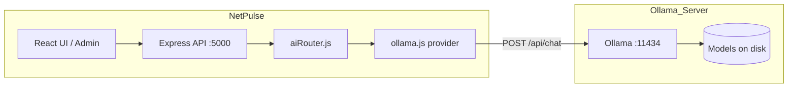

# Ollama integration for NetPulse

Guide to install Ollama on a server, pull models, configure NetPulse, and wire AI tools (triage, NL search, anomalies, chat).

**Repo:** netpulse / SocMon  
**Last updated:** June 2026

---

## Table of contents

1. [Architecture](#1-architecture)
2. [Install Ollama on a Linux server](#2-install-ollama-on-a-linux-server)
3. [Install and manage models](#3-install-and-manage-models)
4. [Ollama server configuration](#4-ollama-server-configuration)
5. [NetPulse configuration](#5-netpulse-configuration)
6. [Verify the connection](#6-verify-the-connection)
7. [NetPulse AI tools (how Ollama is used)](#7-netpulse-ai-tools-how-ollama-is-used)
8. [Optional: Ollama in Docker](#8-optional-ollama-in-docker)
9. [Optional: Cursor / external agent tools](#9-optional-cursor--external-agent-tools)
10. [Troubleshooting](#10-troubleshooting)

---

## 1. Architecture



NetPulse does **not** embed Ollama. The API calls your Ollama host over HTTP using `OLLAMA_HOST`. Provider code: `server/src/services/ai/providers/ollama.js`.

Supported env switch:

| Variable | Values | Purpose |
|----------|--------|---------|
| `AI_PROVIDER` | `ollama` | Select Ollama instead of `claude` or `openai` |
| `OLLAMA_HOST` | Base URL, no trailing slash | e.g. `http://192.168.1.50:11434` |
| `OLLAMA_MODEL` | Model name from `ollama list` | e.g. `llama3.1:8b`, `mistral`, `qwen2.5:7b` |

Restart the NetPulse server after changing `.env`. `GET /health` returns `{ "ai": "ollama" }` when configured.

---

## 2. Install Ollama on a Linux server

These steps assume **Ubuntu 22.04 / 24.04** (or similar Debian-based Linux). For other distros see [https://ollama.com/download](https://ollama.com/download).

### 2.1 One-line install

```bash
curl -fsSL https://ollama.com/install.sh | sh
```

This installs the `ollama` CLI, creates a `ollama` systemd service, and starts it on port **11434**.

### 2.2 Confirm the service

```bash
sudo systemctl status ollama
sudo systemctl enable ollama   # start on boot
```

### 2.3 Hardware notes

| Use case | RAM (approx.) | GPU |
|----------|---------------|-----|
| Dev / light triage (`llama3.2:3b`, `phi3:mini`) | 8 GB | Optional |
| Production SOC assistant (`llama3.1:8b`, `mistral:7b`) | 16 GB | Recommended |
| Larger context / reasoning (`llama3.1:70b`, `qwen2.5:32b`) | 64 GB+ | Strong GPU or CPU-only (slow) |

Ollama uses CPU if no GPU is detected; responses will be slower but work for low-volume triage.

---

## 3. Install and manage models

### 3.1 Pull a model (required before NetPulse can chat)

Run on the **Ollama server**:

```bash
# General SOC/NOC assistant — good default
ollama pull llama3.1:8b

# Smaller / faster (dev or low RAM)
ollama pull llama3.2:3b

# Strong JSON / instruction following (alert triage)
ollama pull mistral:7b
ollama pull qwen2.5:7b
```

Set `OLLAMA_MODEL` to the exact tag shown by `ollama list` (e.g. `llama3.1:8b`, not `llama3` unless that tag exists).

### 3.2 List, run, remove

```bash
ollama list
ollama run llama3.1:8b "Summarize a firewall deny spike in one sentence."
ollama rm llama3.1:8b          # remove a model to free disk
```

### 3.3 Recommended models for NetPulse tools

| Tool | File | Needs | Suggested models |
|------|------|-------|------------------|
| Alert triage (JSON) | `server/src/services/ai/triage.js` | Strict JSON output | `mistral:7b`, `qwen2.5:7b`, `llama3.1:8b` |
| NL → Elasticsearch | `server/src/services/ai/nlSearch.js` | Structured DSL | `llama3.1:8b`, `qwen2.5:7b` |
| Anomaly summary | `server/src/services/ai/anomaly.js` | Prose + JSON | Same as above |
| Chat / reports | `aiRouter.chat()` | General reasoning | `llama3.1:8b` or larger |

Start with **one** model, verify NetPulse health + a test chat, then add others if you need speed vs quality tradeoffs.

---

## 4. Ollama server configuration

### 4.1 Listen address (important for remote NetPulse)

By default Ollama binds to `127.0.0.1` — only local processes can reach it.

If NetPulse runs on a **different host** (or in Docker while Ollama is on the host), configure Ollama to listen on the LAN interface:

```bash
sudo mkdir -p /etc/systemd/system/ollama.service.d
sudo tee /etc/systemd/system/ollama.service.d/override.conf <<'EOF'
[Service]
Environment="OLLAMA_HOST=0.0.0.0:11434"
EOF
sudo systemctl daemon-reload
sudo systemctl restart ollama
```

**Security:** Restrict port `11434` with firewall so only the NetPulse server IP can connect:

```bash
# UFW example — replace 10.0.0.5 with your NetPulse server IP
sudo ufw allow from 10.0.0.5 to any port 11434 proto tcp
sudo ufw deny 11434/tcp
```

Prefer binding to a specific internal IP instead of `0.0.0.0` when possible:

```bash
Environment="OLLAMA_HOST=192.168.1.50:11434"
```

### 4.2 Useful Ollama environment variables

| Variable | Example | Purpose |
|----------|---------|---------|
| `OLLAMA_HOST` | `0.0.0.0:11434` | Listen address |
| `OLLAMA_MODELS` | `/data/ollama/models` | Custom model storage path |
| `OLLAMA_NUM_PARALLEL` | `2` | Concurrent requests |
| `OLLAMA_MAX_LOADED_MODELS` | `1` | Limit RAM on small servers |
| `OLLAMA_KEEP_ALIVE` | `5m` | Unload model after idle time |

Edit overrides under `/etc/systemd/system/ollama.service.d/`, then `systemctl daemon-reload && systemctl restart ollama`.

### 4.3 API endpoints NetPulse uses

| Endpoint | Used by NetPulse |
|----------|------------------|
| `POST /api/chat` | Yes — `ollama.js` provider |
| `GET /api/tags` | Useful for health checks |
| `POST /api/generate` | Not used by NetPulse today |

---

## 5. NetPulse configuration

Edit the project root `.env` (loaded by Docker Compose and the server). See also `server/.env.example`.

### 5.1 Ollama on a separate server (typical production)

```env
AI_PROVIDER=ollama
OLLAMA_HOST=http://192.168.1.50:11434
OLLAMA_MODEL=llama3.1:8b
```

### 5.2 Ollama on the same machine as NetPulse (bare metal API)

```env
AI_PROVIDER=ollama
OLLAMA_HOST=http://127.0.0.1:11434
OLLAMA_MODEL=llama3.1:8b
```

### 5.3 NetPulse in Docker, Ollama on the Docker **host**

Linux:

```env
OLLAMA_HOST=http://host.docker.internal:11434
```

If `host.docker.internal` is unavailable, use the host gateway IP (often `172.17.0.1`) or add to `docker-compose.yml` under `server`:

```yaml
extra_hosts:
  - "host.docker.internal:host-gateway"
```

Ensure Ollama listens on `0.0.0.0:11434` (§4.1), not only `127.0.0.1`.

### 5.4 Both in Docker on the same Compose network

Add an `ollama` service (see [§8](#8-optional-ollama-in-docker)) and set:

```env
OLLAMA_HOST=http://ollama:11434
OLLAMA_MODEL=llama3.1:8b
```

### 5.5 Apply and restart

```bash
# Dev stack
docker compose restart server

# Prod stack
docker compose -f docker-compose.prod.yml restart server
```

Or bare metal: `cd server && npm run dev` (or your process manager).

Admin UI (`Admin → System → AI provider`) can switch to `ollama` once `POST /api/ai/provider` is implemented; until then, use `.env` + restart.

---

## 6. Verify the connection

### 6.1 From the Ollama server

```bash
curl http://127.0.0.1:11434/api/tags
ollama run llama3.1:8b "Hello"
```

### 6.2 From the NetPulse server (same network)

```bash
curl -s http://192.168.1.50:11434/api/tags | head
curl -s http://192.168.1.50:11434/api/chat -d '{
  "model": "llama3.1:8b",
  "messages": [{"role": "user", "content": "Say OK"}],
  "stream": false
}'
```

Expect JSON with `message.content`.

### 6.3 NetPulse health

```bash
curl -s http://localhost:5000/health
# {"status":"ok","version":"1.0.0","ai":"ollama"}
```

Check server logs on startup: `AI provider: ollama`.

---

## 7. NetPulse AI tools (how Ollama is used)

All tools go through `server/src/services/ai/aiRouter.js`, which delegates to the active provider (`ollama` when `AI_PROVIDER=ollama`).

### 7.1 Library services (implemented today)

| Service | Import | Role |
|---------|--------|------|
| `chat(messages, options)` | `./aiRouter.js` | Multi-turn chat |
| `complete(prompt, options)` | `./aiRouter.js` | Single prompt |
| `triageAlert(alert)` | `./triage.js` | Alert → JSON severity/category |
| `nlSearch(question)` | `./nlSearch.js` | Natural language → ES query |
| `summarizeAnomalies(site)` | `./anomaly.js` | Firewall stats → anomaly summary |

Example — call triage from server code or a future route:

```javascript
import { triageAlert } from '../services/ai/triage.js'

const result = await triageAlert({
  srcip: '10.1.2.3',
  dstip: '8.8.8.8',
  action: 'deny',
  message: 'TCP port scan',
  device_name: 'fw-dc1',
  site_name: 'HQ',
})
// { severity, category, summary, recommendation, ... }
```

The Ollama provider sends:

- **Endpoint:** `{OLLAMA_HOST}/api/chat`
- **Body:** `{ model, messages, stream: false }`
- **System prompt:** from each tool’s `SYSTEM` constant or default *"You are Lenskart AI."*

### 7.2 HTTP API (planned — wire these to expose tools in the UI)

`client/src/api/ai.js` expects:

| Method | Path | Tool |
|--------|------|------|
| `POST` | `/api/ai/chat` | Chat with optional portal context |
| `POST` | `/api/ai/search` | NL → ES (`nlSearch`) |
| `POST` | `/api/ai/triage` | Alert triage |
| `GET` | `/api/ai/anomalies` | Anomaly summary |
| `GET/POST` | `/api/ai/provider` | Read/switch provider |

**Current state:** `server/src/routes/ai.js` only implements `GET /` stub. Implement the routes above and import `chat`, `triageAlert`, `nlSearch`, etc. — they will automatically use Ollama when `AI_PROVIDER=ollama`.

See [PORTAL-LLM-FLOWS.md](./PORTAL-LLM-FLOWS.md) §4 and §11 for portal context builder and implementation priority.

### 7.3 Minimal route example (for developers)

```javascript
import { Router } from 'express'
import { authenticate } from '../middleware/auth.js'
import { chat, getAIProvider } from '../services/ai/aiRouter.js'
import { triageAlert } from '../services/ai/triage.js'
import { nlSearch } from '../services/ai/nlSearch.js'

const router = Router()
router.use(authenticate)

router.get('/provider', (req, res) => res.json({ provider: getAIProvider().name }))
router.post('/chat', async (req, res) => {
  const text = await chat(req.body.messages || [])
  res.json({ content: text })
})
router.post('/triage', async (req, res) => {
  res.json(await triageAlert(req.body.alert || {}))
})
router.post('/search', async (req, res) => {
  res.json(await nlSearch(req.body.question))
})

export default router
```

Mount is already at `/api/ai` in `server/src/index.js`.

---

## 8. Optional: Ollama in Docker

Add to `docker-compose.yml` or a separate `docker-compose.ollama.yml`:

```yaml
services:
  ollama:
    image: ollama/ollama:latest
    container_name: netpulse-ollama
    ports:
      - "11434:11434"
    volumes:
      - ollama-data:/root/.ollama
    networks:
      - netpulse
    restart: unless-stopped
    # Optional GPU (NVIDIA):
    # deploy:
    #   resources:
    #     reservations:
    #       devices:
    #         - driver: nvidia
    #           count: 1
    #           capabilities: [gpu]

volumes:
  ollama-data:
```

Pull a model inside the container:

```bash
docker exec -it netpulse-ollama ollama pull llama3.1:8b
```

NetPulse `.env`:

```env
AI_PROVIDER=ollama
OLLAMA_HOST=http://ollama:11434
OLLAMA_MODEL=llama3.1:8b
```

Ensure the `server` service `depends_on: ollama` or start Ollama first.

---

## 9. Optional: Cursor / external agent tools

For Cursor or other agents that should **query NetPulse data** and **reason with Ollama**:

1. **NetPulse data:** `POST /api/auth/login` → JWT → call module APIs (store monitor, Sentinel, logs, etc.). Details: [PORTAL-LLM-FLOWS.md §5](./PORTAL-LLM-FLOWS.md#5-external-llm-agent-flow).
2. **Reasoning:** Point the agent at the same Ollama server (`OLLAMA_HOST`) or use NetPulse `/api/ai/chat` once implemented.
3. **MCP tools (optional):** Define one tool per NetPulse `GET` endpoint (e.g. `store_monitor_overview`, `sentinel_dashboard`) so the agent fetches fresh JSON each turn instead of stale context.

Do not put secrets in prompts: JWTs, `.env` values, device passwords, Nexs session creds.

---

## 10. Troubleshooting

| Symptom | Likely cause | Fix |
|---------|--------------|-----|
| `ECONNREFUSED` from NetPulse | Wrong `OLLAMA_HOST` or Ollama not running | Check `systemctl status ollama`, curl from NetPulse host |
| `404 model not found` | Model not pulled | `ollama pull <OLLAMA_MODEL>` on Ollama server |
| Works on host, fails from Docker | Ollama bound to `127.0.0.1` only | Set `OLLAMA_HOST=0.0.0.0:11434` + firewall (§4.1) |
| Slow responses | CPU-only or large model | Use smaller model (`llama3.2:3b`) or add GPU |
| Invalid JSON from triage | Model ignores JSON instruction | Try `mistral:7b` or `qwen2.5:7b`; triage falls back to safe defaults on parse error |
| `/health` still shows `claude` | `.env` not loaded or not restarted | Set `AI_PROVIDER=ollama`, restart server container |
| Admin “Switch to ollama” fails | `POST /api/ai/provider` not implemented | Use `.env` until route is added |

### Debug Ollama logs

```bash
sudo journalctl -u ollama -f
```

### Test NetPulse provider directly (Node REPL on server)

```bash
cd server
node -e "
  process.env.AI_PROVIDER='ollama';
  process.env.OLLAMA_HOST='http://127.0.0.1:11434';
  process.env.OLLAMA_MODEL='llama3.1:8b';
  import('./src/services/ai/aiRouter.js').then(m =>
    m.complete('Reply with exactly: netpulse-ok').then(console.log)
  );
"
```

---

## Quick start checklist

- [ ] Install Ollama on server (`curl -fsSL https://ollama.com/install.sh | sh`)
- [ ] Pull model: `ollama pull llama3.1:8b`
- [ ] Configure listen + firewall if NetPulse is remote
- [ ] Set `AI_PROVIDER=ollama`, `OLLAMA_HOST`, `OLLAMA_MODEL` in `.env`
- [ ] Restart NetPulse server
- [ ] Verify: `curl /health` and Ollama `/api/chat` from NetPulse host
- [ ] (Optional) Implement `/api/ai/*` routes to expose tools in the UI

**Related docs:** [PORTAL-LLM-FLOWS.md](./PORTAL-LLM-FLOWS.md) · [server/.env.example](../server/.env.example)
