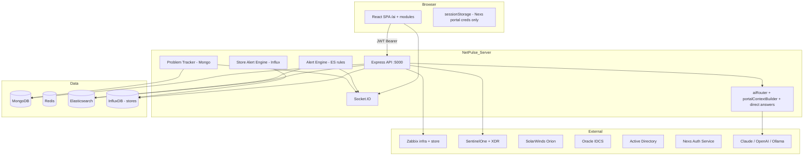
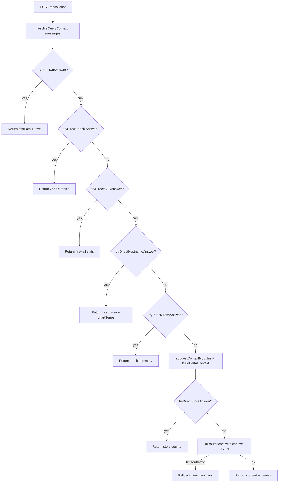
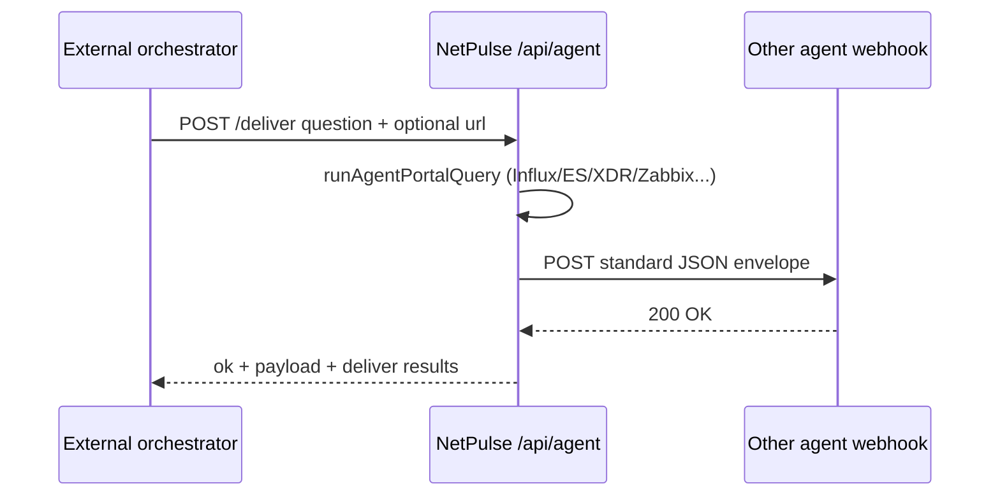

# NetPulse — Portal data & LLM agent flows

Complete reference for how NetPulse (SocMon) modules work, how data moves through the stack, and how the **AI Assistant** loads portal context for LLM agents (in-app or external).

**Repo:** netpulse / SocMon  
**Last aligned with codebase:** June 2026 (post AI Assistant implementation)

**Related docs:**

- [EXTERNAL-AGENT-API.md](./EXTERNAL-AGENT-API.md) — **send data to external / other agents** (`/api/agent/*`)
- [OLLAMA-INTEGRATION.md](./OLLAMA-INTEGRATION.md) — Ollama install, models, and provider tuning

---

## Table of contents

1. [System architecture](#1-system-architecture)
2. [Portal pages and access control](#2-portal-pages-and-access-control)
3. [Module-by-module data flows](#3-module-by-module-data-flows)
4. [AI / LLM flows (implemented)](#4-ai--llm-flows-implemented)
5. [External agent API (`/api/agent`)](#5-external-agent-api-apagent)
6. [Export flows](#6-export-flows)
7. [Real-time events (Socket.IO)](#7-real-time-events-socketio)
8. [Startup background jobs](#8-startup-background-jobs)
9. [Environment variables](#9-environment-variables)
10. [Security checklist](#10-security-checklist)
11. [Remaining work](#11-remaining-work)
12. [API quick reference](#12-api-quick-reference)

---

## 1. System architecture



**Stack:** React client → Express API (`server/src/index.js`) → integrations on the server. The **AI Assistant** (`/ai`) calls `/api/ai/*`, which fetches live or periodic data, may answer without an LLM (**fast path**), or passes JSON context into `aiRouter.chat()`.

**Health:** `GET /health` → `{ status, version, ai: <AI_PROVIDER> }`

---

## 2. Portal pages and access control

### 2.1 UI routes

| Path | `pageKey` | Page |
|------|-----------|------|
| `/soc` | `soc` | SOC dashboard |
| `/noc` | `noc` | NOC dashboard |
| `/sentinel` | `sentinel` | Sentinel ES + SentinelOne / XDR tabs |
| `/infra` | `infra` | Zabbix infra monitoring |
| `/store-zabbix` | `storeZabbix` | Store Zabbix |
| `/store-monitor` | `storeMonitor` | Store network monitor |
| `/solarwinds` | `solarwinds` | SolarWinds |
| `/ai` | `ai` | **AI Assistant** (Chat, Log search, Anomalies, Triage) |
| `/idcs` | `idcs` | Oracle IDCS users |
| `/ad` | `ad` | Active Directory |
| `/nexs` | `nexs` | Nexs user management |
| `/email-sim` | `emailSim` | Phishing simulation |
| `/tickets` | `tickets` | Tickets (stub) |
| `/reports` | `reports` | Reports |
| `/admin` | `admin` | Admin (AI provider switch) |

**Client:** `PageRoute` + `canAccessPage()` in `client/src/utils/pageAccess.js`.  
**Server keys:** `server/src/constants/appPages.js`.

### 2.2 Roles

| Role | Access |
|------|--------|
| `admin` | All pages, `full` write |
| `custom_admin` | `allowedPages[]`, full on those |
| `role_template` | `CustomRole.pages[]` → `read` / `full` per page |
| `analyst` / `viewer` | `allowedPages[]`; viewer is read-only |

Login: `POST /api/auth/login` → JWT + `allowedPages` + `pageAccess` (`computeUserPageAccess.js`).

### 2.3 Server JWT enforcement

| JWT + page guard | JWT only | No route JWT* |
|------------------|----------|---------------|
| `ai` (`requireAppPage('ai')`), `store-monitor`, `store-alerts`, `solarwinds`, `email-sim`, `sentinel-one`, `devices`, `sites`, `ssh-sessions`, `nexs`, `ad`, `idcs`, `custom-roles` | — | `sentinel`, `logs`, `zabbix`, `store-zabbix`, `stats`, `alerts`, `tickets`, `users` |

\*UI still sends Bearer token; restrict network exposure or add `authenticate` before automation.

**AI page:** All `/api/ai/*` routes (except provider admin) require JWT + `pageKey: ai`.

---

## 3. Module-by-module data flows

### 3.1 SOC / NOC

| REST | Data |
|------|------|
| `GET /api/stats/soc`, `/noc`, `/report` | ES `firewall-*`, `cisco-*` + Mongo tickets |
| `GET /api/logs/*` | Search, KPIs, `GET/POST /export` CSV |

**AI usage:** `soc` context module (ES aggs, last 1h) or **direct SOC answer** (`socDirectAnswer.js`) for firewall deny/traffic questions without LLM.

**Live:** Socket.IO `live:events` from `websocket.js` (firewall/cisco, 5–15s when clients connected).

---

### 3.2 Sentinel (Elasticsearch)

**Mount:** `/api/sentinel` — no route JWT.

| Endpoint | Purpose |
|----------|---------|
| `GET /stats`, `/threats`, `/connectivity`, `/dashboard` | Dashboard KPIs |
| `GET /events`, `/hostname-search`, `/usb-device-search` | Lists / search |
| `GET/POST /events/export` | CSV stream |

Index: `ES_SENTINEL_INDEX` (default `sentinel-*`).

---

### 3.3 SentinelOne + XDR

**Mount:** `/api/sentinel-one` — JWT required.

| Area | Endpoints |
|------|-----------|
| Threats | `GET /threats`, `POST /threats/mitigate`, etc. |
| XDR | `POST /xdr/powerQuery`, `/xdr/powerQuery/export`, `/xdr/fields`, `/xdr/suggest` |

Upstream S1 401/403 → HTTP **502** (SPA must not logout on integration auth failure).

**AI usage:** **Direct XDR path** (`xdrDirectAnswer.js`) — builds PowerQuery from natural language (e.g. failed logins, process creation), runs `runSentinelOnePowerQuery`, returns table text **without LLM**. Requires `sentinel` page access.

---

### 3.4 Zabbix (infra + store)

| Mount | Env prefix |
|-------|------------|
| `/api/zabbix` | `ZABBIX_*` |
| `/api/store-zabbix` | `STORE_ZABBIX_*` |

**AI usage:** **Direct Zabbix path** (`zabbixDirectAnswer.js`) — host availability, problems, IP lookup, FortiGate/Cisco device filters, infra summary. Uses Zabbix JSON-RPC live; not in `AI_CONTEXT_MODULES` list (fast path only). Requires `infra` and/or `storeZabbix` page.

---

### 3.5 Store Network Monitor

**Mount:** `/api/store-monitor` — JWT + `storeMonitor` page.

| Endpoint | Purpose |
|----------|---------|
| `GET /overview` | **Primary snapshot** — `summary` + `stores[]` |
| `GET /stores`, `/stores/:storeTag/history` | List + time series |
| `GET /crashes`, `/crashes/raw` | Crash analytics |
| `GET /reports/:type` | XLSX: inventory, uptime, issues, connectivity, speedtest |
| `GET /problem-history` | Mongo lifecycle |
| `GET/PUT /settings` | Settings |

**AI context modules:** `storeMonitor` (live Influx), `storeProblems` (Mongo tracker).  
**AI fast paths:** store counts (`tryDirectStoreAnswer`), crashes (`tryDirectCrashAnswer`), hostname bundle (`hostnameDirectAnswer` + `environmentDataFetcher.js`).

**Background:** Problem tracker ~2 min → `store:problems:changed` on Socket.IO.

---

### 3.6 Store alerts

**Mount:** `/api/store-alerts` — JWT + `storeMonitor` page.

**Engine:** `storeAlertEngine.js` — evaluates `StoreAlertRule` against Influx snapshot + crash counts; notifies via `storeAlertNotify.js` (Slack, Google Chat, email); persists `StoreAlertEvent` (includes affected `stores[]`, dispatch results).

| API | Purpose |
|-----|---------|
| CRUD `/` | Rules |
| `POST /evaluate` | Manual run |
| `GET /events` | History |

Interval: `STORE_ALERT_INTERVAL_MS` (default 120000).

---

### 3.7 ES alert engine (firewall/Cisco)

`alertEngine.js` — 60s, Mongo `AlertRule` → ES count → `alert:fired` on Socket.IO.

`/api/alerts` CRUD — no route JWT today.

---

### 3.8 SolarWinds, devices, IDCS, AD, Nexs, email-sim

| Module | Mount | Guard |
|--------|-------|-------|
| SolarWinds | `/api/solarwinds` | JWT + `solarwinds` |
| Devices / Web UI / SSH / RDP | `/api/devices`, `/api/web-mgmt`, Socket.IO `web-ssh`, `/api/rdp` | JWT on device routes |
| IDCS | `/api/idcs` | JWT |
| AD | `/api/ad` | JWT |
| Nexs | `/api/nexs` | JWT; separate Nexs token via `POST /login` |
| Email sim | `/api/email-sim` | JWT + `emailSim`; public `/api/email-sim/pub` |

**Not wired into AI context modules yet** — use REST exports or future module IDs.

**Nexs browser portal:** `client/src/api/nexsPortal.js` — direct `app.nexs.lenskart.com` login; creds in `sessionStorage` only.

---

## 4. AI / LLM flows (implemented)

### 4.1 UI

`client/src/pages/AI/AIPage.jsx` — tabs:

| Tab | API |
|-----|-----|
| Chat | `POST /api/ai/chat` |
| Log search | `POST /api/ai/search` (NL → ES) |
| Anomalies | `GET /api/ai/anomalies` |
| Alert triage | `POST /api/ai/triage` |

Client: `client/src/api/ai.js` — supports `chat(messages, { modules, autoModules })`, `getModules()`, provider endpoints.

### 4.2 HTTP API (`server/src/routes/ai.js`)

| Method | Path | Auth | Purpose |
|--------|------|------|---------|
| GET | `/api/ai/modules` | JWT + `ai` | Context modules user may enable |
| GET | `/api/ai/provider` | JWT | Active provider + model name |
| POST | `/api/ai/provider` | JWT + **admin** | Switch `AI_PROVIDER` at runtime |
| POST | `/api/ai/chat` | JWT + `ai` | Main assistant (see flow below) |
| POST | `/api/ai/search` | JWT + `ai` | `naturalLanguageSearch()` |
| POST | `/api/ai/triage` | JWT + `ai` | `triageAlert(alert)` |
| GET | `/api/ai/anomalies` | JWT + `ai` | `detectAnomalies(?site)` |
| POST | `/api/ai/report` | JWT + `ai` | **501** — not implemented |

### 4.3 Providers

`server/src/services/ai/aiRouter.js` → `claude` | `openai` | `gemini` | `ollama` via `AI_PROVIDER`.

| Env | Purpose |
|-----|---------|
| `AI_PROVIDER` | Provider selection |
| `ANTHROPIC_API_KEY`, `CLAUDE_MODEL` | Claude |
| `OPENAI_API_KEY`, `OPENAI_MODEL` | OpenAI |
| `GEMINI_API_KEY`, `GEMINI_MODEL` | Google Gemini |
| `OLLAMA_HOST`, `OLLAMA_MODEL` | Ollama |
| `AI_LLM_TIMEOUT_MS` | Chat LLM race timeout (default `120000`) |

### 4.4 Portal context modules (`portalContextBuilder.js`)

Exposed on `GET /api/ai/modules` (filtered by user `allowedPages`):

| Module ID | Page key | Freshness | Built by |
|-----------|----------|-----------|----------|
| `storeMonitor` | `storeMonitor` | **live** | `fetchStoreSnapshot` + summary; detail level `summary` \| `standard` \| `full` |
| `storeProblems` | `storeMonitor` | **periodic** | `StoreProblemHistory` active rows + tracker metadata |
| `soc` | `soc` | **live** | ES `firewall-*` aggs (1h) |

**Not in context builder (direct-query only):** `sentinelXdr`, Zabbix, hostname multi-source, crashes — handled by fast-path services below.

`POST /api/ai/chat` body:

```json
{
  "messages": [{ "role": "user", "content": "..." }],
  "modules": ["storeMonitor", "soc"],
  "autoModules": true
}
```

- `autoModules` (default `true`): `suggestContextModules()` adds modules from keywords + `resolveQueryContext()` thread state.
- `buildPortalContext(user, moduleIds)` runs builders in parallel.
- `formatContextForPrompt()` injects JSON into the system prompt with **anti-hallucination** rules.

### 4.5 Chat decision flow



**Fast paths** skip the LLM for latency and accuracy. Response fields:

| Field | Meaning |
|-------|---------|
| `content` | Assistant text (markdown-friendly) |
| `provider` | `claude` / `openai` / `gemini` / `ollama` |
| `contextMeta` | Per-source freshness, `fetchedAt`, errors |
| `contextPreview` | Small UI summary object |
| `queryContext` | `{ topic, appName, hostname, isFollowUp, ... }` |
| `modulesUsed` | Module IDs or logical sources |
| `fastPath` | `true` if no LLM call |
| `chartSeries` | Optional sparkline data (hostname path) |
| `metrics` | `{ totalMs, contextMs, llmMs, mode }` |

**Modes in `metrics.mode`:** `direct-xdr`, `direct-zabbix`, `direct-soc`, `direct-hostname`, `direct-crash`, `direct`, `llm`, `fallback-*`.

### 4.6 Query understanding (`queryContext.js`)

- Parses **time range** from text (`last 1 hr` → `-1h`).
- Detects **topic**: crash, xdr, store, soc, hostname, zabbix.
- **Follow-up** handling: reuses prior topic, app name, range from assistant message.
- Store hostname pattern: `RP1537-E519BNZT` (`STORE_HOSTNAME_RE`).
- **App name** extraction for crash follow-ups (“which stores for OrderMaster”).

### 4.7 Direct-answer services (file map)

| File | Triggers (examples) | Data sources |
|------|---------------------|--------------|
| `xdrDirectAnswer.js` | Sentinel, XDR, failed login, PowerQuery | Sentinel XDR API |
| `zabbixDirectAnswer.js` | Zabbix, infra summary, IP, FortiGate/Cisco status | Zabbix JSON-RPC (infra + store) |
| `socDirectAnswer.js` | Firewall deny, FortiGate traffic | Elasticsearch |
| `hostnameDirectAnswer.js` | “full details for RPxxxx-…” | Influx snapshot + history + problems + `environmentDataFetcher` |
| `environmentDataFetcher.js` | Bundled with hostname | Influx, ES sentinel/firewall/cisco, S1 threats |
| `portalContextBuilder.js` | `tryDirectStoreAnswer`, `tryDirectCrashAnswer`, context build | Influx, Mongo, ES |

### 4.8 Other AI endpoints

| Endpoint | Service | Notes |
|----------|---------|-------|
| `POST /api/ai/search` | `nlSearch.js` | NL → ES DSL → search `firewall-*` / `cisco-*`; returns hits |
| `POST /api/ai/triage` | `triage.js` | Alert object → JSON severity, recommendation, FP likelihood |
| `GET /api/ai/anomalies` | `anomaly.js` | Firewall deny rate aggs + LLM summary; optional `?site=` |

### 4.9 System prompt rules (`CHAT_SYSTEM_BASE`)

- Identify as **NetPulse AI** for Lenskart NOC/SOC/store operations.
- **Never invent** hostnames, counts, or XDR rows.
- Use only portal context JSON or direct-query results.
- State **live vs periodic** freshness when citing numbers.

---

## 5. External agent API (`/api/agent`)

Dedicated API for **external agents** and **other downstream agents** (webhooks, second LLM, n8n, Cursor scripts). Implemented in `server/src/routes/agentPortal.js` and `server/src/services/ai/agentPortal.js`.

**Full reference:** [EXTERNAL-AGENT-API.md](./EXTERNAL-AGENT-API.md)

### Authentication

| Method | Use case |
|--------|----------|
| `Authorization: Bearer <JWT>` | Scripts using a real analyst login |
| `X-Netpulse-Agent-Key: <secret>` | Unattended automation (recommended) |

**Env:** `NETPULSE_AGENT_API_KEY`, `NETPULSE_AGENT_USER_EMAIL` (service user with desired `allowedPages`).

### Endpoints

| Method | Path | Purpose |
|--------|------|---------|
| GET | `/api/agent/meta` | Discovery |
| GET | `/api/agent/modules` | Allowed context module IDs |
| POST | `/api/agent/context` | Export `portalContext` JSON (+ optional `prompt`) |
| POST | `/api/agent/query` | Fast-path answers + context envelope (no NetPulse LLM) |
| POST | `/api/agent/forward` | POST envelope to another agent URL |
| POST | `/api/agent/deliver` | Query + forward in one step |

### Flow: send data to another agent



**Standard payload** (`source: netpulse`, `version: 1`):

- `portalContext` — module JSON (live / periodic metadata in `meta`)
- `prompt` — ready-to-paste LLM context block
- `directAnswer.content` — when fast path matched (prefer this for accuracy)
- `contextPreview` — small summary for UIs
- `instructions` — anti-hallucination rules

**Forward targets:** per-request `url`, or env `NETPULSE_AGENT_FORWARD_URL` / `NETPULSE_AGENT_FORWARD_URLS` (comma-separated for multiple agents).

### vs in-app AI

| Need | API |
|------|-----|
| NetPulse-hosted LLM reply | `POST /api/ai/chat` (requires `ai` page) |
| Raw data for **your** LLM | `POST /api/agent/context` or `/query` |
| Push to **another** service | `POST /api/agent/forward` or `/deliver` |
| Module REST without AI | `GET /api/store-monitor/overview`, etc. |

**Cursor / MCP:** Tool-wrap `/api/agent/query` and `/api/agent/context`; see [EXTERNAL-AGENT-API.md](./EXTERNAL-AGENT-API.md).

---

## 6. Export flows

| Module | Endpoint / UI | Format |
|--------|---------------|--------|
| Store Monitor | `GET /api/store-monitor/reports/:type` | XLSX |
| Sentinel ES | `GET/POST /api/sentinel/events/export` | CSV stream |
| Logs | `GET/POST /api/logs/export` | CSV stream |
| Sentinel XDR | `POST /api/sentinel-one/xdr/powerQuery/export` | CSV blob |
| IDCS | `GET /api/idcs/export/users` | XLSX/ZIP |

Streaming URLs skip gzip (`isStreamingExportUrl` in `server/src/index.js`).

---

## 7. Real-time events (Socket.IO)

| Event | Source |
|-------|--------|
| `live:events` | Recent firewall/cisco docs |
| `alert:fired` | ES alert rules |
| `store:problems:changed` | Problem tracker |
| `web-ssh:*` | Device terminal |

---

## 8. Startup background jobs

| Job | Interval (default) |
|-----|-------------------|
| `startAlertEngine` | 60 s |
| `startStoreAlertEngine` | 120 s (`STORE_ALERT_INTERVAL_MS`) |
| `startProblemSnapshotter` | 120 s (`PROBLEM_TRACKER_INTERVAL_MS`) |
| WebSocket log poller | 5–15 s when clients connected |

---

## 9. Environment variables

| Area | Variables |
|------|-----------|
| Core | `MONGO_URI`, `REDIS_URL`, `JWT_SECRET`, `CORS_ORIGIN`, `PORT` |
| Elasticsearch | `ES_HOST`, `ES_USER`, `ES_PASSWORD`, `ES_SENTINEL_INDEX` |
| AI | `AI_PROVIDER`, `ANTHROPIC_API_KEY`, `OPENAI_API_KEY`, `OLLAMA_HOST`, `OLLAMA_MODEL`, `AI_LLM_TIMEOUT_MS` |
| External agents | `NETPULSE_AGENT_API_KEY`, `NETPULSE_AGENT_API_KEYS`, `NETPULSE_AGENT_USER_EMAIL`, `NETPULSE_AGENT_FORWARD_URL(S)`, `NETPULSE_AGENT_FORWARD_SECRET` |
| SentinelOne | `SENTINEL_ONE_*`, `SENTINEL_ONE_XDR_*` |
| Zabbix | `ZABBIX_*`, `STORE_ZABBIX_*` |
| Store monitor | `INFLUX_*` |
| Store alerts / tracker | `STORE_ALERT_INTERVAL_MS`, `PROBLEM_TRACKER_INTERVAL_MS`, `PROBLEM_HISTORY_TTL_DAYS` |
| SolarWinds | `ORION_*` |
| IDCS / AD / Nexs / Email sim | See `server/.env.example` |

---

## 10. Security checklist

1. Grant automation users `ai` plus only the data pages they need.
2. Do not put JWTs, Nexs passwords, device creds, or SMTP secrets in LLM prompts.
3. Prefer **`POST /api/ai/chat`** or direct GETs over UI scraping.
4. Add `authenticate` to open routers (`logs`, `sentinel`, `zabbix`, `stats`, `users`) if the API is internet-facing.
5. Trust **fast-path** and **context JSON** over model memory for counts and hostnames.
6. Rate limit: 500 req / 15 min per `/api/*` (with documented skips).

---

## 11. Remaining work

| Item | Status |
|------|--------|
| `POST /api/ai/chat` + context builder + fast paths | **Done** |
| `AIPage` UI (chat, search, triage, anomalies) | **Done** |
| `GET /api/ai/modules`, provider endpoints | **Done** |
| **External agent API** `/api/agent/*` (context, query, forward, deliver) | **Done** — see [EXTERNAL-AGENT-API.md](./EXTERNAL-AGENT-API.md) |
| `POST /api/ai/report` | **501** — not implemented |
| Portal context for Zabbix / SolarWinds / IDCS / Nexs in `AI_CONTEXT_MODULES` | Optional — Zabbix via **direct** path + `/api/agent/query` |
| `authenticate` on `logs`, `sentinel`, `zabbix`, `stats`, `users` | Recommended for exposed deployments |
| MCP tool pack for Cursor | Optional — use `/api/agent` tools |

---

## 12. API quick reference

| Question | Primary API |
|----------|-------------|
| Export data for external LLM | `POST /api/agent/context` or `/query` |
| Send data to another agent webhook | `POST /api/agent/deliver` |
| Natural language assistant (in-app LLM) | `POST /api/ai/chat` |
| Allowed context modules | `GET /api/ai/modules` or `GET /api/agent/modules` |
| Store offline / summary | `GET /api/store-monitor/overview` or chat fast path |
| App crashes | Chat or `GET /api/store-monitor/crashes` |
| Hostname full detail | Chat (`direct-hostname`) or overview + history |
| Sentinel XDR / failed login | Chat (`direct-xdr`) or `POST /api/sentinel-one/xdr/powerQuery` |
| Zabbix host down | Chat (`direct-zabbix`) or `GET /api/zabbix/problems` |
| Firewall denies | Chat (`direct-soc`) or `GET /api/stats/soc` |
| NL log search | `POST /api/ai/search` |
| Alert triage | `POST /api/ai/triage` |
| Store alert history | `GET /api/store-alerts/events` |
| Problem timeline | `GET /api/store-monitor/problem-history` |

---

## Related source files

| Area | Path |
|------|------|
| External agent routes | `server/src/routes/agentPortal.js` |
| Agent export / forward | `server/src/services/ai/agentPortal.js` |
| Agent auth | `server/src/middleware/agentAuth.js` |
| Client agent API | `client/src/api/agentPortal.js` |
| AI routes | `server/src/routes/ai.js` |
| Context + modules | `server/src/services/ai/portalContextBuilder.js` |
| Query parsing | `server/src/services/ai/queryContext.js` |
| Direct answers | `server/src/services/ai/*DirectAnswer.js`, `environmentDataFetcher.js` |
| AI router | `server/src/services/ai/aiRouter.js` |
| Client API | `client/src/api/ai.js` |
| UI | `client/src/pages/AI/AIPage.jsx` |
| Server entry | `server/src/index.js` |
| Env template | `server/.env.example` |

---

*Update this document when adding context modules, `POST /api/ai/report`, or new fast-path handlers.*
